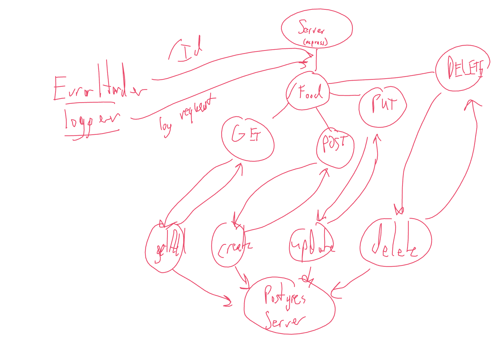

# Basic REST API

June 16, 2021

## Description

This is a basic REST API made using Express. Testing with Jest and Supertest. Mocking with Sqlite and Sequelizer.

## Start up

Clone the repo from github, and install the necessary dependencies.

```BASH
npm i
npm start
```

## UML



## Routes

### /orders

#### GET

* Status code: 200
* JSON response:
  * Returns and array of `Orders` items
  * Name: STRING
  * Calories: INTEGER

#### POST

* Status code: 200
* JSON response:
  * Returns a newly created `Orders` item
  * Name: STRING
  * Calories: INTEGER

### /orders/:id

#### GET

* Status code: 200
* JSON response:
  * Returns a single `Orders` item based on the id
  * Name: STRING
  * Calories: INTEGER

#### PUT

* Status code: 200
* JSON response:
  * Returns the modified `Orders` item based on the id
  * Name: STRING
  * Calories: INTEGER

#### DELETE

* Status code: 204
* Removes a single `Orders` item based on the id, *no body*

----

### /costumers

#### GET

* Status code: 200
* JSON response:
  * Returns and array of `Customers` items
  * Name: STRING
  * Material: STRING

#### POST

* Status code: 200
* JSON response:
  * Returns a newly created `Customers` item
  * Name: STRING
  * Material: STRING

### /customers/:customerId

#### GET

* Status code: 200
* JSON response:
  * Returns a single `Customers` item based on the id
  * Name: STRING
  * Material: STRING

#### PUT

* Status code: 200
* JSON response:
  * Returns the modified `Customers` item based on the id
  * Name: STRING
  * Material: STRING

#### DELETE

* Status code: 204
* Removes a single `Customers` item based on the id, *no body*

## Contributors

Tim Egorov, Tek Jones.

<!--  -->